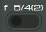

# Casio memory-8a handheld calculator web version

[Demo avialable here](https://butterflytyphoon-kxjxwy.stormkit.dev/).

## About calculator

This is a web recreation of a mid-seventies handheld calculator. It works without operator precedence (so 2+2*2 will return 8).

## Features

### Turning on 

To enable the calculator, simply click on the slider in the upper left corner.

### Rounding

You can choose between automatic decimal places, and rounding to two decimal places.

### Percent

The percentage of a number is calculated as follows: the required percentage of the number is entered, the multiplication button is pressed, the number from which the percentage is found is entered, the percentage button is pressed.

It is also possible to add a percentage of a number to this number: enter the number,  press the addition button,  enter the desired percentage, then press the percentage button.

### Square root

To find the square root of a number, simply click the "square root" button.

## Created with Create React App

This project was bootstrapped with [Create React App](https://github.com/facebook/create-react-app).

## Available Scripts

In the project directory, you can run:

### `npm start`

Runs the app in the development mode.\
Open [http://localhost:3000](http://localhost:3000) to view it in your browser.

The page will reload when you make changes.\
You may also see any lint errors in the console.

### `npm run build`

Builds the app for production to the `build` folder.\
It correctly bundles React in production mode and optimizes the build for the best performance.

The build is minified and the filenames include the hashes.\
Your app is ready to be deployed!

See the section about [deployment](https://facebook.github.io/create-react-app/docs/deployment) for more information.

